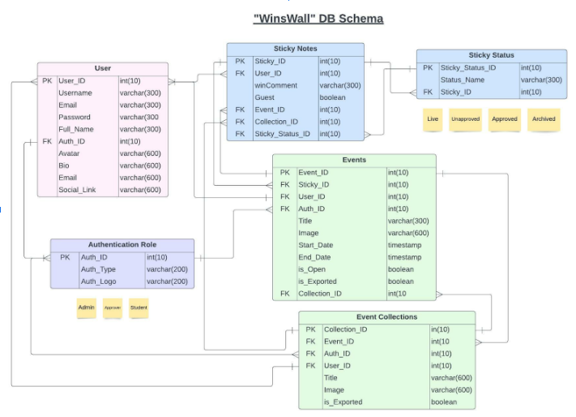
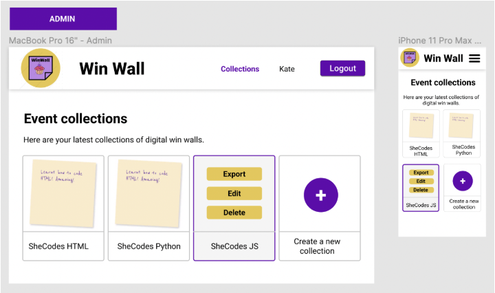
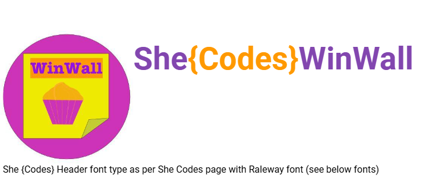
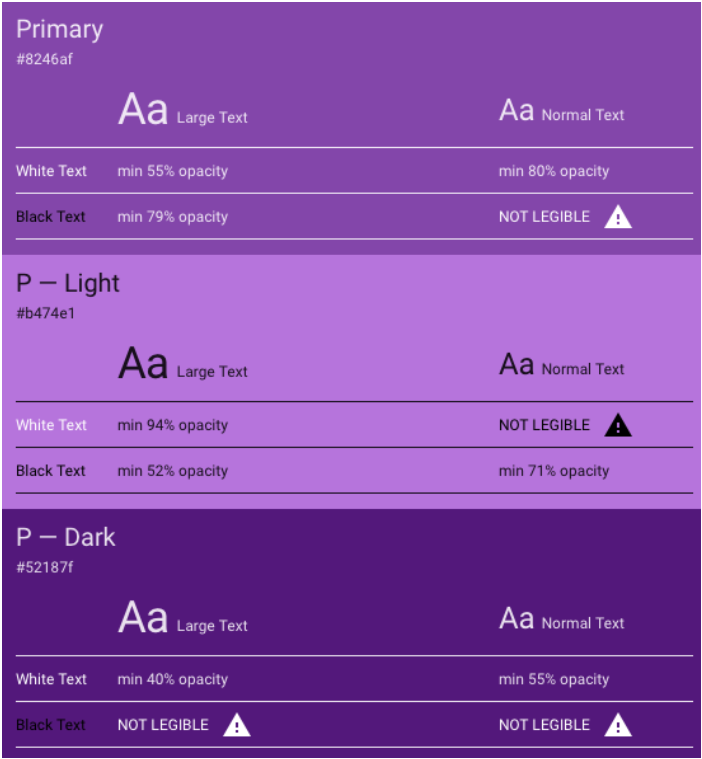
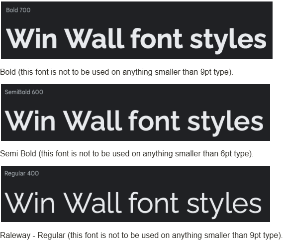

# Your Product Name
> KICKIT

## Table of Contents

- [Your Product Name](#your-product-name)
  - [Table of Contents](#table-of-contents)
  - [Mission Statement](#mission-statement)
  - [Features](#features)
  - [2. Core Features (MVP)](#2-core-features-mvp)
    - [2.1 Authentication](#21-authentication)
    - [2.2 Lists](#22-lists)
      - [Role Permissions](#role-permissions)
    - [2.3 Roles](#23-roles)
    - [2.4 List Items](#24-list-items)
    - [2.5 Voting System](#25-voting-system)
    - [2.6 Tagging](#26-tagging)
    - [2.8 Dashboard](#28-dashboard)
    - [2.9 Security \& Privacy](#29-security--privacy)
    - [Summary](#summary)
  - [3. Accessibility Requirements](#3-accessibility-requirements)
    - [Users](#users)
    - [TODO Sticky Notes](#todo-sticky-notes)
    - [Collections](#collections)
    - [Pages/Endpoint Functionality](#pagesendpoint-functionality)
    - [TODO Nice To Haves](#todo-nice-to-haves)
  - [Technical Implementation](#technical-implementation)
    - [Back-End](#back-end)
    - [Front-End](#front-end)
    - [Git \& Deployment](#git--deployment)
  - [Target Audience](#target-audience)
  - [Back-end Implementation](#back-end-implementation)
    - [API Specification](#api-specification)
    - [TO DO Object Definitions](#to-do-object-definitions)
      - [Users](#users-1)
      - [Sticky Notes](#sticky-notes)
    - [TODO Database Schema](#todo-database-schema)
  - [Front-end Implementation](#front-end-implementation)
    - [TODO Wireframes](#todo-wireframes)
      - [TODO Home Page](#todo-home-page)
      - [Collection List Page](#collection-list-page)
    - [Logo](#logo)
    - [Colours](#colours)
      - [Primary](#primary)
      - [Secondary](#secondary)
    - [Font](#font)
  - [Deliverable Tracker](#deliverable-tracker)
    - [Frontend](#frontend)


## Mission Statement

KICKIT is a collaborative bucket list platform that helps friends, families, and teams decide what to do together and follow through — without relying on social media.

> It transforms "we should do that sometime" into **"lock it in."**

## Features
## 2. Core Features (MVP)

### 2.1 Authentication

- Google login
- Secure, non-sequential IDs
- Auth required for all protected endpoints

### 2.2 Lists

Users can:

- Create lists
- Delete their lists
- Leave lists
- Manage list visibility (private/public)
- Limit number of lists per user

#### Role Permissions

| Action        | Owner | Editor | Viewer |
|---------------|:-----:|:------:|:------:|
| Edit List     | ✅    | ❌     | ❌     |
| Add Item      | ✅    | ✅     | ❌     |
| Invite Person | ✅    | ❌     | ❌     |
| Vote          | ✅    | ✅     | ✅     |
| Delete List   | ✅    | ❌     | ❌     |

### 2.3 Roles

Three roles:

- **Owner** — Full control over the list
- **Editor** — Can add items and vote
- **Viewer** — Can vote only

Capabilities vary by role (see table above).

### 2.4 List Items

Each item contains:

- Title
- Description
- Tags
- Status
- Vote count

**Statuses:**

| Status     | Description                        |
|------------|------------------------------------|
| Planned    | Default state when item is created |
| Locked In  | Group has committed to this item   |
| Completed  | Item has been done                 |
| Cancelled  | Item is no longer happening        |

### 2.5 Voting System

- One vote per user per item
- Public lists allow voting without login (optional decision)
- Vote tracking per user

### 2.6 Tagging

Custom tags + suggested presets:

- `Cheap`
- `Weekend`
- `Big Trip`
- `Food`

### 2.8 Dashboard

- Lists user belongs to
- Recent activity
- Notification indicator

### 2.9 Security & Privacy

- Non-sequential IDs (UUID)
- CSRF protection
- HSTS
- SameSite cookies
- Title filtering
- Access revoked immediately on role removal

### Summary 
Provide Guest users ability to vote on public lists. Once posted, users can invite others to private lists. Admin and editor access will also allow collaboration on lists.

---

## 3. Accessibility Requirements

- Screen reader compatibility
- WCAG contrast compliance
- No blue/green-only visual indicators
- Readable font sizes
- Simple navigation

### Users

| Type               | Access                                                                                                                                                                                                                                                                                             | Role type assignment                                |
| :----------------- | :------------------------------------------------------------------------------------------------------------------------------------------------------------------------------------------------------------------------------------------------------------------------------------------------- | :-------------------------------------------------- |
| Superuser or admin | <br> - All access   <br> - Can log in  <br> - Can log out  <br> - Create and manage lists  <br> - Create and manage lists  <br> - Create and manage other users  <br> - Approve, archive and edit lists |
| Owner           | <br> - Can log in  <br> - Can log out  <br> - Approve, archive and edit own lists  <br> - Can See and edit their details via profile page  | Mentors, volunteers, shecodes11507 staff  |
| User              | <br> - View public lists, View invited private lists  <br> - Vote on public & invited lists  |    | Public: Users who can vote on public lists without logging in |

### TODO Sticky Notes

| Feature                                        | Access                                                                                                                                                                                                           | Notes/Conditions                                                                                              |
| :--------------------------------------------- | :--------------------------------------------------------------------------------------------------------------------------------------------------------------------------------------------------------------- | :------------------------------------------------------------------------------------------------------------ |
| Create                                         | Can be created by anyone with URL                                                                                                                                                                                | <br> - Limit length of sticky note text  <br> - option to add hashtag (TBC: as main text or additional field) |
| Post                                           | Post as Guest                                                                                                                                                                                                    | <br> - Submits Sticky note to Live event board                                                                |
| View                                           | Guests, Approvers and Admin can view posts via Live event board Admin and Approvers can view once status updated from Live                                                                                       |                                                                                                               |
| Edit                                           | Can be edited by Admin and Approvers                                                                                                                                                                             | <br> - Edit sticky note text, eg: for spelling errors before Status is set to approved                        |
| Statuses: Live, Unapproved, Approved, Archived | <br> - Auto status of notes will be ‘live’ based on linked event  <br> - Auto status of notes will be unapproved based on closure of linked event  <br> - Update to Approved and Archived by Admin and Approvers |                                                                                                               |
| Export                                         | <br> - Export as Admin only                                                                                                                                                                                      | <br> - CSV file  <br> - Format: collection, event, sticky note text                                           |
| Flag- Is Exported                              | <br> - Auto flag based on whether Admin has exported the sticky note                                                                                                                                             | <br> - Boolean                                                                                                |
| Link to Collection                             | <br> - Controlled by Admin                                                                                                                                                                                       | <br> - Based on type of event, eg: shecodes flash, plus, other event types.                                   |
| Link to Event                                  | <br> - Auto link based on event URL  <br> - Link to event can be edited by Admin                                                                                                                                 |                                                                                                               |
| Link to Approver                               | <br> - Controlled by Admin and Approver who creates the event                                                                                                                                                    | <br> - Approver is User who is managing or associated with admin of the event                                 |

### Collections

| Feature                           | Access                     | Notes/Conditions           |
| :-------------------------------- | :------------------------- | :------------------------- |
| Assign events to a collection     | <br> - Based on event type |                            |
| Assign approver to a collection   | <br> - admin               |                            |
| Default event board live duration | <br> - Admin               | <br> - Based on event type |
| View event boards by collection   | <br> - Admin, Approver     |                            |
| Export notes by Collection        | <br> - Admin               |                            |

### Pages/Endpoint Functionality

| Endpoint              | functionality                                                                                                                                                                     | comments                                                                                         |
| :-------------------- | :-------------------------------------------------------------------------------------------------------------------------------------------------------------------------------- | :----------------------------------------------------------------------------------------------- |
| Create and post notes | <br> - Available to anyone with URL   <br> - Add sticky notes   <br> - Post sticky notes                                                                                          | <br> - Sticky note ‘feel’ is preferred  <br> - Easy to read and accessible  <br> - Good contrast |
| Event board           | <br> - Once note is posted, redirect to live session  notes  <br> - Able to post more notes (redirect back or add directly?)  <br> - Live session ends at midnight – day of event | <br> - view live notes  <br> - search notes by text/hashtag                                      |
| Admin page            | All admin functions  <br> - can also create another admin account                                                                                                                 | <br> - Requires auth  <br> - initial admin created by DB                                         |
| Register as Approver  | <br> - users can register as approvers  <br> - once registered, approver can log in                                                                                               | Requires shecodes email address to be used                                                       |
| Approver page         | Approver functions                                                                                                                                                                | Requires auth Easy to read, accessible, easy to use for new users                                |
| Profile page          | <br> - All registered users  <br> - Can view their personal info  <br> - Can update their info                                                                                    | Requires auth                                                                                    |

### TODO Nice To Haves

- Register during or after event; Sign up for additional events: Email address, Name, Event
- History of my own notes as Registered user
- Events I have registered for as Registered user
- Be able to edit my own notes – as Registered user but only until its been approved
- Bulk update sticky note status
- QR code generation 
- Use QR codes to access event as guest

## Technical Implementation

### Back-End

- Django / DRF API
- Python

### Front-End

- React / JavaScript
- HTML/CSS

### Git & Deployment
- Heroku
- Netlify
- GitHub

This application's back-end will be deployed to Heroku. The front-end will be deployed separately to Netlify.
 
We will also use Insomnia to ensure API endpoints are working smoothly (we will utilise a local and deployed environment in Insomnia).

## Target Audience

**Primary:**

- Adults mid-20s to late-30s
- Friend groups
- Families
- Social media-light users

**TODO User Statements**

## Back-end Implementation
### API Specification

| HTTP Method | URL                                 | Purpose                                                                                                                                  | Request Body                                                                                                       | Successful Response Code | Authentication and Authorization                      |
| :---------- | :---------------------------------- | :--------------------------------------------------------------------------------------------------------------------------------------- | :----------------------------------------------------------------------------------------------------------------- | :----------------------- | :---------------------------------------------------- |
| POST        | /login                              | Allow users to log in                                                                                                                    | ““Username”:”string”, “password”:”string”                                                                          | 200                      | Token auth                                            |
| POST        | /logout                             | Allow users to log out ( end active session)                                                                                             | ““Username”:”string”, “password”:”string”                                                                          | 200                      | Will clear user log in session \- remove stored token |
| POST        | /Register                           | Create new student or approver user                                                                                                      | “Username”:”string”, “FullName”: “string” “Email”:”string”,”Password”:”string”, ”Password2”:”string”,              | 201                      | Admin                                                 |
| PUT         | /Profile/ID                         | Edit user                                                                                                                                | “Username”:”string”, “FullName”: “string” “Email”:”string”, “Avatar”:”string”,  “Bio”:”string”, “Socials”:”string” | 200                      | Admin, approver or student with matching ID           |
| GET         | /Profile/ID                         | View User profile                                                                                                                        | NA                                                                                                                 | 200                      | Any                                                   |
| DELETE      | /User/ID                            | Delete user                                                                                                                              | NA                                                                                                                 | 204                      | Admin, approver or student with matching ID           |
| POST        | /EventCollection                    | Create new Event Collection                                                                                                              | “Title”:”string”, “IsExported”:”boolean” “Approver”: integer                                                       | 201                      | Admin                                                 |
| PUT         | /EventCollection/Id                 | Update Event collection                                                                                                                  | “Title”:”string”, “IsExported”:”boolean”                                                                           | 200                      | Admin, Approver linked to event?                      |
| DELETE      | /EventCollection/Id                 | Delete Event collection                                                                                                                  | NA                                                                                                                 | 204                      | Admin                                                 |
| POST        | /EventBoard/                        | Create new Event board                                                                                                                   | “Title”: “string”, “StartDate”:”datetime”, “EndDate:”datetime”                                                     | 201                      | Admin, approvers                                      |
| PUT         | /EventBoard/ID                      | Update Event board                                                                                                                       | “Title”: “string”, “StartDate”:”datetime”, “EndDate:”datetime”                                                     | 200                      | Admin, approvers                                      |
| DELETE      | /EventBoard/ID                      | Delete Event board                                                                                                                       | NA                                                                                                                 | 204                      | Admin or author of event                              |
| GET         | /EventBoard/ID                      | Get Event board details                                                                                                                  | NA                                                                                                                 | 200                      | Open access                                           |
| POST        | /stickyNote/                        | Create a new sticky note as Guest user                                                                                                   | “WinComment”:”string”                                                                                              | 201                      | Open access                                           |
| GET         | /stickyNotes/?Status=Live\&Event.ID | Get Sticky notes for an event  Use query params to filter by event ID and Status                                                         | NA                                                                                                                 | 200                      | Open access                                           |
| GET         | /stickyNotes/?Event.ID              | Get Sticky notes for an event                                                                                                            | NA                                                                                                                 | 200                      | Admin, approvers                                      |
| GET         | /stickyNotes/                       | Export sticky notes as CSV (eg:response.setContentType("text/csv")) Can optionally filter by: event ID, Status, isexported, collectionId | NA                                                                                                                 | 200                      | Admin                                                 |
| PUT         | /stickyNotes/ID                     | Edit sticky note, update status of sticky note to Approved or Archived                                                                   | “WinComment”:”string”                                                                                              | 200                      | Admin, approvers                                      |
| POST        | /StickyStatus                       | Create available statuses for stickyNotes                                                                                                | “StatusName”:”string”                                                                                              | 201                      | Admin                                                 |
| GET         | /StickyStatus                       | Get all statuses                                                                                                                         | NA                                                                                                                 | 200                      | Admin                                                 |

### TO DO Object Definitions

> [!NOTE]  
> Define the actual objects that your API returns. The example GET method above says it returns “all projects”, so we need to define what a “project” looks like. Example below.

#### Users
| Field              | Data type |
| :----------------- | :-------- |
| *User\_ID (PK)*    |           |
| *Username*         | string    |
| FullName           | string    |
| *Email*            | string    |
| *Password*         | string    |
| Auth\_ID (FK)      | integer   |
| BucketListId (FK)  | integer   |
| Avatar             | string    |
| Bio                | string    |
| SocialLink         | string    |

#### Sticky Notes
| Field                   | Data Type |
| :---------------------- | :-------- |
| Sticky\_ID (PK)         | integer   |
| WinComment              | string    |
| Guest                   | boolean   |
| UserId (FK)             | integer   |
| Event\_Id (FK)          | integrer  |
| Collection\_Id (FK)     | integrer  |
| Sticky\_Status\_ID (FK) | integrer  |

> [!NOTE]  
> ... etc

### TODO Database Schema
> [!NOTE]  
> Insert an image of your database schema (could be a photo of a hand-drawn schema or a screenshot of a schema created using a tool such as ​​https://drawsql.app/). Example below.



## Front-end Implementation

### TODO Wireframes

> [!NOTE]  
> Insert image(s) of your wireframes (could be a photo of hand-drawn wireframes or a screenshot of wireframes created using a tool such as https://www.mockflow.com/).

See all wireframes and how Admins, Approvers and Students would see the Win Wall website: https://www.figma.com/file/cvP0Kc7lAX39Fvo12C5aLa/Win-Wall?node-id=22%3A1345 

#### TODO Home Page


#### Collection List Page


> [!NOTE]  
> etc...

### Logo


### Colours
#### Primary



#### Secondary


### Font

Google fonts:

```css
@import url('https://fonts.googleapis.com/css2?family=Raleway:wght@400;600;700&display=swap');
font-family: 'Raleway', sans-serif;
```



## Deliverable Tracker
### Frontend

| Deliverable              | Status | Comments |
|--------------------------|--------|----------|
| Login flow               |        |          |
| Dashboard                |        |          |
| List view                |        |          |
| Item creation/edit       |        |          |
| Voting interaction       |        |          |
| Status updates           |        |          |
| Delete list              |        |          |
| Leave list               |        |          |
| Mobile responsive layout |        |          |
| Tag filtering            |        |          |