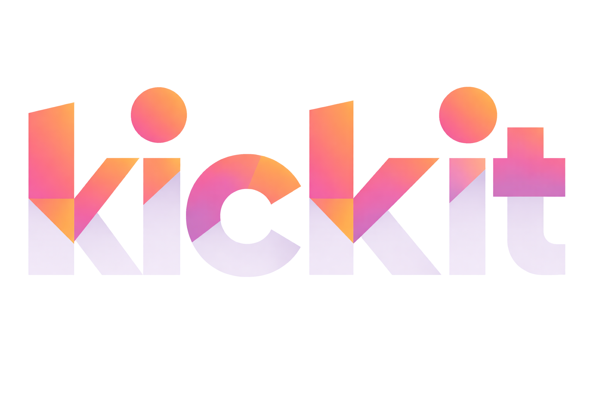
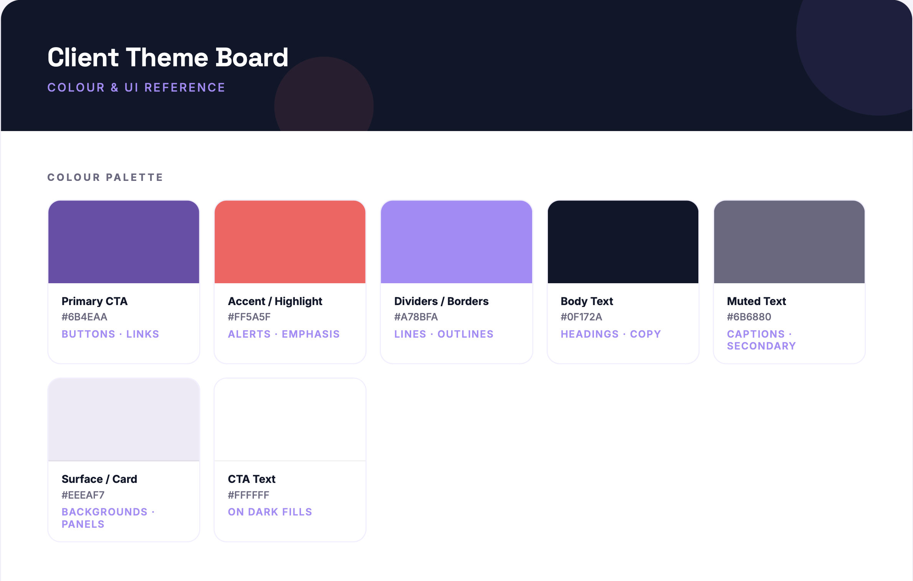
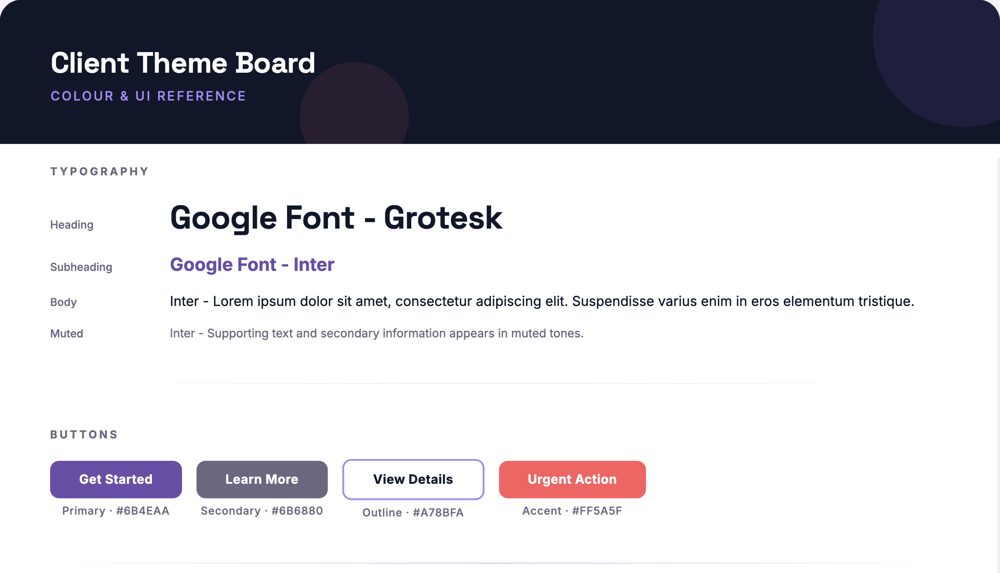
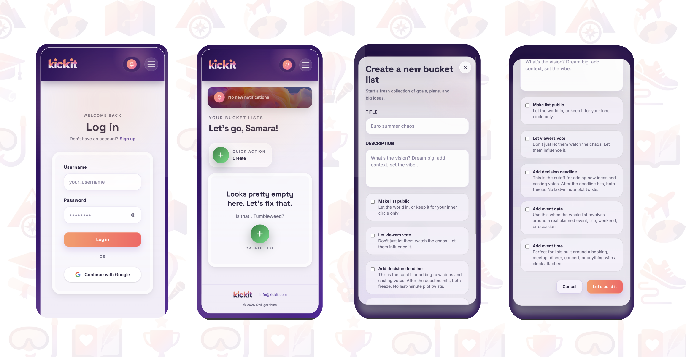

# KICKIT — Frontend

> A collaborative bucket list app. Build goals, share adventures, vote on what to do next — with friends, family, or the group chat.

---

## Table of Contents

- [KICKIT — Frontend](#kickit--frontend)
  - [Table of Contents](#table-of-contents)
  - [Mission Statement](#mission-statement)
  - [Target Audience](#target-audience)
  - [Overview](#overview)
  - [Tech Stack](#tech-stack)
  - [Architecture](#architecture)
  - [Core Features](#core-features)
    - [Authentication](#authentication)
    - [Lists](#lists)
    - [Roles \& Permissions](#roles--permissions)
    - [List Items](#list-items)
    - [Voting System](#voting-system)
    - [Notifications](#notifications)
    - [Dashboard](#dashboard)
    - [Security \& Privacy](#security--privacy)
    - [Accessibility](#accessibility)
  - [Project Structure](#project-structure)
  - [Getting Started](#getting-started)
    - [Prerequisites](#prerequisites)
    - [Installation](#installation)
    - [Environment Variables](#environment-variables)
    - [Running Locally](#running-locally)
  - [Pages \& Routing](#pages--routing)
  - [State Management \& Auth](#state-management--auth)
    - [Auth Flow — Username / Password](#auth-flow--username--password)
    - [Auth Flow — Google OAuth](#auth-flow--google-oauth)
    - [Auth Context](#auth-context)
    - [Notifications Context](#notifications-context)
  - [API Integration](#api-integration)
  - [Component Overview](#component-overview)
  - [Styling](#styling)
    - [CSS Architecture](#css-architecture)
    - [Logo](#logo)
    - [Colours](#colours)
      - [UI ColourPalette](#ui-colourpalette)
    - [Font](#font)
    - [Example](#example)
  - [Deployment](#deployment)
  - [Known Issues / Gaps](#known-issues--gaps)

---

## Mission Statement

KICKIT is a collaborative bucket list platform that helps friends, families, and teams decide what to do together and follow through — without relying on social media.

> It transforms *"we should do that sometime"* into **"lock it in."**

---

## Target Audience

**Primary users:**

- Adults in their mid-20s to late-30s
- Friend groups planning shared experiences
- Families coordinating activities together
- Social media-light users who want a focused, private collaboration tool

KICKIT is built for groups who already know what they want to do, but need a simple, structured way to align on priorities, track progress, and actually follow through.

---

## Overview

KICKIT is the React frontend for the collaborative bucket list platform. Users register, log in (via username/password or Google OAuth), create shared bucket lists, invite members, propose items, vote on them, and track progress toward completing experiences together.

The app communicates exclusively with the Django REST Framework backend via a RESTful JSON API using JWT Bearer tokens stored in `localStorage`.

---

## Tech Stack

| Layer | Technology |
|-------|-----------|
| Framework | React 19 |
| Build Tool | Vite 7 |
| Routing | React Router DOM v7 |
| Styling | Tailwind CSS v4 + custom CSS |
| Animation | Framer Motion |
| Icons | Lucide React |
| Maps (in-progress) | Leaflet / React Leaflet, Google Maps JS API Loader |
| Language | JavaScript (ES Modules) |
| Linting | ESLint 9 |

---

## Architecture

The frontend is a Single Page Application (SPA) following a **Context + Custom Hooks** pattern — no Redux or external state library.

```
Browser
  └── React App (Vite SPA)
        ├── Providers
        │     ├── AuthProvider           ← JWT auth state
        │     ├── BannerProvider         ← Global toast notifications
        │     └── NotificationsProvider  ← Polled in-app notifications
        │
        └── React Router
              └── Layout (NavBar + <Outlet /> + Footer)
                    └── Pages
                          └── Components
                                └── Custom Hooks
                                      └── API Layer (fetch)
                                            └── Backend REST API
```

Key architectural decisions:

- Auth state lives in `AuthContext` (via `AuthProvider`) and persists to `localStorage` under the keys `access` and `refresh`.
- All API calls are plain `fetch()` functions organised by resource in `src/api/`. Each accepts a JWT token and returns parsed JSON or throws a descriptive error.
- Custom hooks (`useBucketLists`, `useBucketList`, `useVotes`, etc.) wrap the API layer and own their loading/error state.
- Voting uses **optimistic UI updates** — scores update immediately in local state and roll back silently on API failure.
- Notifications are polled every 30 seconds via `NotificationsProvider`.

---

## Core Features

### Authentication

- **Username/password login** — credentials posted to `POST /api/token/`; JWT access (1 h) and refresh (7 days) tokens returned and stored in `localStorage`
- **Google OAuth 2.0** — single click via django-allauth redirect; tokens returned as query params to the frontend callback route
- **Registration** — create an account with username, email, and password; JWT issued immediately on signup, no separate login step required
- **Persistent sessions** — auth state is restored from `localStorage` on page load and validated against `GET /users/me/`
- **Pending invite handling** — if a user follows an invite link before logging in, the invite token is saved in `sessionStorage` and automatically accepted after login/registration completes

### Lists

Users can:

- Create bucket lists with a title, description, optional decision deadline, and scheduling dates/times
- Set visibility to **private** (members only) or **public** (anyone can view)
- Edit list metadata (owner only)
- Delete lists they own
- Leave lists they are a member of
- **Freeze** a list to lock it down once decisions are finalised — prevents new items from being added (owner only; owner is still able to add items to a frozen list)
- Export individual item dates to a calendar

### Roles & Permissions

Three roles control what each member can do within a list:

- **Owner** — Full control: create, edit, delete the list; manage members; generate invite links; change item status; freeze/unfreeze
- **Editor** — Can add items, edit and delete their own items (while the list is not frozen), and vote
- **Viewer** — Read-only by default; can vote only if the owner enables viewer voting (`allow_viewer_voting`)

| Action | Owner | Editor | Viewer |
|--------|:-----:|:------:|:------:|
| View list (private) | ✅ | ✅ | ✅ |
| Edit list metadata | ✅ | ❌ | ❌ |
| Delete list | ✅ | ❌ | ❌ |
| Freeze / unfreeze | ✅ | ❌ | ❌ |
| Add items | ✅ | ✅ | ❌ |
| Edit own items | ✅ | ✅ *(not frozen)* | ❌ |
| Delete own items | ✅ | ✅ *(not frozen)* | ❌ |
| Change item status | ✅ | ❌ | ❌ |
| Vote | ✅ | ✅ | ✅ *(if enabled)* |
| React (emoji) | ✅ | ✅ | ✅ |
| Invite members | ✅ | ❌ | ❌ |
| Manage members | ✅ | ❌ | ❌ |
| Leave list | ✅ *(n/a)* | ✅ | ✅ |

### List Items

Each item contains:

| Field | Description |
|-------|-------------|
| Title | Short name for the activity |
| Description | Optional longer details |
| Status | Current lifecycle state |
| Vote score | Computed as `upvotes − downvotes` |
| Scheduling | Optional start/end date and start/end time |
| Reactions | Per-user emoji reaction |
| Creator | The member who proposed the item |

**Item status lifecycle:**

| Status | Description |
|--------|-------------|
| `proposed` | Default — item has been suggested |
| `locked_in` | Group has committed to doing this item |
| `complete` | Item has been done ✅ |

Only the list owner can change item status. Setting status to `complete` automatically records a `completed_at` timestamp.

**Emoji reactions** — Members can react to any item with one of six types: 🔥 fire, ❤️ love, 👀 sketchy, 😂 dead, 🚫 hardpass, 🙅 nope. One reaction per user per item; clicking the same reaction again removes it.

### Voting System

- One vote per user per item (`upvote` or `downvote`)
- Vote score computed dynamically: `upvotes − downvotes`
- Clicking the active vote **toggles it off** (removes the vote)
- Votes use **optimistic UI** — the score updates instantly and reverts on API failure
- Voting is blocked on **frozen** lists
- On public lists, voting can be enabled for viewers via `allow_viewer_voting`

### Notifications

In-app notifications keep members informed of activity across their lists:

| Notification | Trigger |
|-------------|---------|
| Item added | A member adds a new item to a list you belong to |
| Item locked in | An item's status is changed to `locked_in` |
| Item completed | An item's status is changed to `complete` |
| List frozen | The owner freezes a list |
| Freeze reminder | A list's decision deadline is approaching |

The notification bell in the NavBar polls `GET /notifications/unread-count/` every **30 seconds**. Clicking it loads the full notification list. Notifications can be marked as read individually or all at once, and can be dismissed.

### Dashboard

The `/dashboard` page gives each user a personal overview:

- All bucket lists they belong to (as owner, editor, or viewer)
- Progress indicators per list (completed vs total items)
- Member avatars for each list
- Quick-access navigation to each list
- Notification indicator in the NavBar

### Security & Privacy

- **JWT authentication** — stateless Bearer tokens; no server-side sessions required for API access
- **CSRF protection** — Django's CSRF middleware is active; SameSite cookies configured
- **CORS** — restricted to allowed frontend origins only
- **Role-based access control** — enforced server-side on every request; access is revoked immediately when a member's role is changed or they are removed
- **Private lists** — inaccessible to non-members; members-only check enforced on every read and write operation
- **Invite token security** — tokens generated with `secrets.token_urlsafe(32)`; expire after 7 days; regenerating invalidates the previous token

### Accessibility

- Screen reader compatibility intended throughout
- WCAG colour contrast compliance (see [Colours](#colours) below)
- Visual indicators do not rely on colour alone
- Readable font sizes at all breakpoints
- Keyboard-navigable UI
- Simple, consistent navigation structure

---

## Project Structure

```
Owl-gorithms-frontend/
├── index.html                    # Vite entry point
├── vite.config.js                # Vite + React + Tailwind config
├── package.json
├── .env                          # Local environment variables
└── src/
    ├── main.jsx                  # App root: router, providers, ReactDOM.createRoot
    ├── main.css                  # Global CSS imports
    ├── layout.jsx                # App shell: NavBar + <Outlet /> + Footer
    │
    ├── api/                      # Pure fetch() functions (one file per operation)
    │   ├── post-login.js         # POST /api/token/  → { access, refresh }
    │   ├── get-user.js           # GET  /users/me/
    │   ├── bucketlists/          # create, read, update, delete bucket lists
    │   ├── items/                # create, read, update, delete items
    │   ├── invites/              # generate, preview, accept, regenerate invites
    │   ├── memberships/          # update role, delete membership
    │   └── votes/                # submit vote, remove vote
    │
    ├── components/
    │   ├── AuthProvider.jsx      # AuthContext — auth state + setAuth
    │   ├── NotificationsProvider.jsx  # Notification polling context
    │   ├── GoogleLogin.jsx       # "Continue with Google" redirect button
    │   ├── GoogleOAuthCallback.jsx    # Handles /oauth/google/callback tokens
    │   ├── Footer.jsx
    │   ├── Bucketlist/           # BucketListHeader, ActionBar, ItemsPanel, Progress
    │   ├── Dashboard/            # Dashboard layout, DashboardBucketCard, CardGrid, FocusPanel
    │   ├── NavBar/               # NavBar (notification bell, user menu)
    │   ├── UI/                   # Avatar, AvatarGroup, FormModal, BannerProvider,
    │   │                         # VoteControls, RelativeTime
    │   ├── forms/                # CreateBucketListForm, CreateItemForm, RegisterForm
    │   ├── items/                # ExtendedItemCard, ItemDetailCard, ItemDetailPanel
    │   └── modals/               # CalendarExportModal, ConfirmActionModal,
    │                             # DeleteItemModal, EditBucketListModal, EditItemModal,
    │                             # InviteMembersModal, ItemDateModal,
    │                             # StatusUpdateModal, ViewMembersModal
    │
    ├── context/
    │   └── AuthContext.jsx       # ⚠ Legacy file — active auth context is AuthProvider.jsx
    │
    ├── hooks/
    │   ├── use-auth.js           # useAuth() → consumes AuthContext from AuthProvider
    │   ├── use-user.js           # Fetches GET /users/me/
    │   ├── useBucketLists.js     # All user's bucket lists + addBucketList
    │   ├── useBucketList.js      # Single bucket list detail + items
    │   ├── useItems.js           # Items for a list
    │   ├── useItem.js            # Single item detail
    │   ├── useInvites.js         # Invite generation + regeneration
    │   └── useVotes.js           # voteOnItem, clearVote
    │
    ├── pages/
    │   ├── HomePage.jsx          # Marketing / landing page
    │   ├── LoginPage.jsx         # Login form + Google OAuth button
    │   ├── AccountPage.jsx       # Auth-gated dashboard (redirects to /login if unauthenticated)
    │   ├── SingleListView.jsx    # Bucket list detail + animated split-panel item view
    │   ├── BucketListItemPage.jsx # Full-page single item detail
    │   ├── InviteAcceptPage.jsx  # Preview and accept/decline an invite by token
    │   └── NotFoundPage.jsx
    │
    ├── styles/                   # Modular CSS files
    │   ├── tokens.css            # CSS custom properties (design tokens)
    │   ├── base.css
    │   ├── layout.css
    │   ├── app-shell.css
    │   ├── bucketlist.css
    │   ├── buttons.css
    │   ├── forms.css
    │   ├── homepage.css
    │   ├── items.css
    │   ├── modals.css
    │   ├── responsive.css
    │   └── surfaces.css
    │
    ├── assets/                   # SVGs (icons, hero images) and PNGs (logo)
    │
    └── utils/
        ├── completeLogin.js      # Post-auth: fetch user → handle pending invite → navigate
        ├── pendingInvite.js      # sessionStorage helper for invite token persistence
        └── time.js               # Relative time formatting utilities
```

---

## Getting Started

### Prerequisites

- **Node.js** ≥ 18
- **npm** ≥ 9
- The **backend API** running locally (default: `http://127.0.0.1:8000`)

### Installation

```bash
git clone <repository-url>
cd Owl-gorithms-frontend
npm install
```

### Environment Variables

Create a `.env` file in the project root:

```env
VITE_API_URL=http://127.0.0.1:8000
```

| Variable | Description | Example |
|----------|-------------|---------|
| `VITE_API_URL` | Base URL of the Django backend (no trailing slash) | `http://127.0.0.1:8000` |

> All Vite env vars must be prefixed with `VITE_` to be exposed to the browser bundle.

### Running Locally

```bash
npm run dev
```

App will be available at **http://localhost:5173**.

Additional scripts:

```bash
npm run build      # Production build → dist/
npm run preview    # Preview the production build locally
npm run lint       # Run ESLint
```

---

## Pages & Routing

Routes are defined in `src/main.jsx` using React Router `createBrowserRouter`. All routes share a single `<Layout />` shell (NavBar + Outlet + Footer).

| Path | Component | Notes |
|------|-----------|-------|
| `/` | `HomePage` | Public marketing page |
| `/login` | `LoginPage` | Username/password form + Google OAuth button |
| `/dashboard` | `AccountPage` → `Dashboard` | Redirects to `/login` if unauthenticated |
| `/bucketlists/:id` | `SingleListView` | Animated split-panel list + item view |
| `/bucketlists/:listId/items/:itemId` | `BucketListItemPage` | Full-page item detail |
| `/invites/:token` | `InviteAcceptPage` | Invite preview (public) + accept (auth required) |
| `/oauth/google/callback` | `GoogleOAuthCallback` | Extracts JWT from OAuth redirect query params |
| `*` | `NotFoundPage` | 404 fallback |

---

## State Management & Auth

### Auth Flow — Username / Password

1. `LoginPage` submits credentials to `POST /api/token/`
2. Access + refresh tokens written to `localStorage` (`access`, `refresh`)
3. `completeLogin()` calls `GET /users/me/` and sets `AuthContext`
4. If a pending invite token exists in `sessionStorage`, it is auto-accepted and the user is redirected to that list; otherwise redirected to `/dashboard`

### Auth Flow — Google OAuth

1. User clicks "Continue with Google" → browser redirects to `GET /auth/google/login/` on the backend (django-allauth)
2. allauth completes OAuth and redirects to `/api/auth/google/callback/` on the backend
3. Backend issues JWT and redirects to `/oauth/google/callback?access=...&refresh=...` on the frontend
4. `GoogleOAuthCallback` stores tokens in `localStorage` and calls `completeLogin()`

### Auth Context

The active auth context is `components/AuthProvider.jsx`, consumed via `hooks/use-auth.js`:

```js
const { auth, setAuth } = useAuth();
// auth.access  — JWT access token string (or null)
// auth.user    — current user object (or null)
// auth.refresh — JWT refresh token string (or null)
```

Logout clears both tokens from `localStorage` and resets context state.

### Notifications Context

`NotificationsProvider` polls `GET /notifications/unread-count/` every 30 seconds when authenticated. It exposes:

```js
const {
  notifications, unreadCount, isLoading,
  markAsRead, markAllAsRead, dismiss, dismissAll,
  refresh
} = useNotifications();
```

---

## API Integration

All API functions live in `src/api/` and are thin `fetch()` wrappers. They accept a `token` argument and attach it as `Authorization: Bearer <token>`.

**Example — create a bucket list:**

```js
// src/api/bucketlists/create-bucketlist.js
const response = await fetch(`${import.meta.env.VITE_API_URL}/bucketlists/`, {
  method: "POST",
  headers: {
    "Content-Type": "application/json",
    "Authorization": `Bearer ${token}`,
  },
  body: JSON.stringify(data),
});
```

Custom hooks compose these API functions with `useState`/`useEffect`:

```js
// Fetch all user's lists and create new ones
const { bucketLists, isLoading, addBucketList } = useBucketLists();

// Fetch a single list (with items + members)
const { bucketList, loadBucketList } = useBucketList(id);

// Vote on an item
const { voteOnItem, clearVote } = useVotes();
```

**Optimistic voting** — `SingleListView` maintains a `voteOverrides` map keyed by item ID. On click, the score/vote state is updated in local state immediately. If the API call fails, the override is reverted to the previous value.

---

## Component Overview

| Component | Purpose |
|-----------|---------|
| `AuthProvider` | JWT auth state, token persistence, `setAuth` |
| `NotificationsProvider` | Polling notification state + mark-read/dismiss actions |
| `BannerProvider` | Global toast/banner notification context |
| `NavBar` | Top navigation: logo, notification bell, user avatar |
| `Dashboard` | Grid of `DashboardBucketCard` components; focus panel on selection |
| `SingleListView` | Full list view: animated split panel (item list + item detail) |
| `BucketListHeader` | List title, description, scheduling dates, member avatars, action buttons |
| `BucketListActionBar` | Filter tabs (All / Pending / Complete) + completion count |
| `BucketListItemsPanel` | Scrollable list of `BucketListItemCard` components |
| `ItemDetailPanel` | Right-side panel: full item detail, votes, reactions, status, owner actions |
| `VoteControls` | Upvote ↑ / Downvote ↓ buttons with animated score |
| `InviteMembersModal` | Generate + copy editor/viewer invite links |
| `ViewMembersModal` | View, promote/demote, remove members |
| `CalendarExportModal` | Export item dates to calendar |
| `FormModal` | Reusable modal dialog wrapper |
| `GoogleLogin` | Single-click Google OAuth redirect button |
| `GoogleOAuthCallback` | Extracts tokens from query string post-OAuth |

---

## Styling

### CSS Architecture

KICKIT uses **Tailwind CSS v4** for layout and utility classes combined with custom CSS files in `src/styles/`.

- `tokens.css` — CSS custom properties: `--primary-cta`, `--heading-text`, `--muted-text`, `--dividers`, etc. These tokens drive the entire colour system and should be updated here to retheme the app globally.
- Tailwind utility classes are used directly in JSX for spacing, flex, grid, and responsive breakpoints.
- Component-specific overrides live in dedicated CSS files (`bucketlist.css`, `homepage.css`, `modals.css`, etc.)
- All entry/exit animations use **Framer Motion** — page fades, panel slides, list item transitions.

### Logo



### Colours

#### UI ColourPalette



### Font

KICKIT uses a custom brand font for headings alongside a system-safe body font stack.

```css
/* Add to tokens.css or base.css once the final font is confirmed */
@import url('https://fonts.googleapis.com/css2?family=Raleway:wght@400;600;700&display=swap');
font-family: 'Raleway', sans-serif;
```


---

### Example



---

## Deployment

The frontend is designed to deploy to **Netlify** or **Vercel**.

```bash
npm run build
# Output: dist/
```

**Required configuration:**

- Set `VITE_API_URL` to the production backend URL in the hosting platform's environment variables.
- Configure SPA fallback routing (redirect all paths to `index.html`).

For **Netlify**, add `public/_redirects`:

```
/*  /index.html  200
```

For **Vercel**, add `vercel.json`:

```json
{
  "rewrites": [{ "source": "/(.*)", "destination": "/" }]
}
```

---

## Known Issues / Gaps

- **Duplicate auth context files** — `src/context/AuthContext.jsx` is a legacy file that uses `Token` auth headers. The active implementation is `src/components/AuthProvider.jsx` which uses `Bearer` JWT. The legacy file should be removed to avoid confusion.

- **`/register` route missing** — `LoginPage` links to `/register` but no route is defined in the router. `RegisterForm` exists in `src/components/forms/` but is not wired up to a page.

- **Auth-conditional UI commented out** — Multiple blocks in `HomePage` are commented out (e.g. "View My Buckets" button, CTA visibility), meaning the page does not adapt to logged-in state.

- **Public community feed commented out** — The "What people are kicking" community section in `HomePage` is fully commented out.

- **No token refresh logic** — The frontend stores a refresh token but there is no interceptor or background logic to silently refresh an expired access token. Users will be logged out after 1 hour.

- **Map libraries installed but unused** — `@googlemaps/js-api-loader`, `leaflet`, and `react-leaflet` are installed but no map component currently appears in the component tree. This appears to be in-progress work.

- **Google OAuth hardcodes localhost** — `GoogleLoginCallback` in the backend hardcodes `http://localhost:5173` as the redirect destination. This must be environment-variable driven before deploying.

- **No frontend test suite** — No unit, integration, or end-to-end tests exist.
